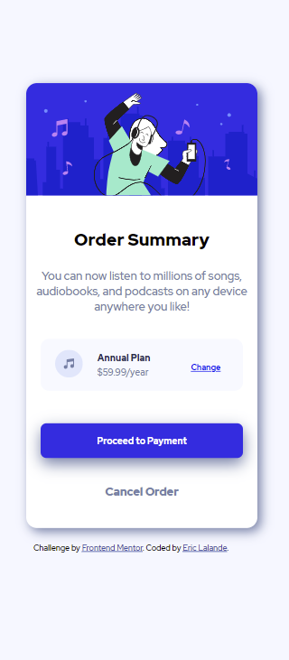
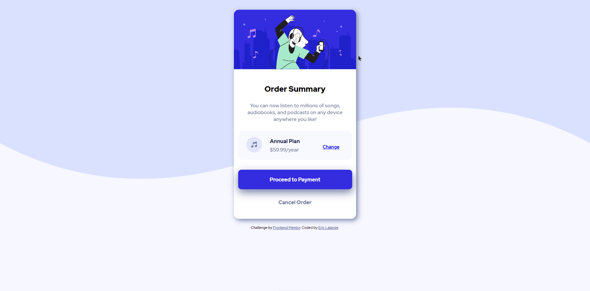

# Frontend Mentor - Order summary card solution

This is a solution to the [Order summary card challenge on Frontend Mentor](https://www.frontendmentor.io/challenges/order-summary-component-QlPmajDUj). Frontend Mentor challenges help you improve your coding skills by building realistic projects.

## Table of contents

- [Frontend Mentor - Order summary card solution](#frontend-mentor---order-summary-card-solution)
  - [Table of contents](#table-of-contents)
  - [Overview](#overview)
    - [The challenge](#the-challenge)
    - [Screenshot](#screenshot)
    - [Links](#links)
  - [My process](#my-process)
    - [Built with](#built-with)
    - [What I learned](#what-i-learned)
    - [Continued development](#continued-development)
    - [Useful resources](#useful-resources)
  - [Author](#author)

## Overview

### The challenge

Users should be able to:

- See hover states for interactive elements

### Screenshot





### Links

- Solution URL: [Add solution URL here](https://your-solution-url.com)
- Live Site URL: [Order Summary Card](https://agitated-beaver-ca36ca.netlify.app/)

## My process

### Built with

- Semantic HTML5 markup
- CSS
- Flexbox

### What I learned

Use this section to recap over some of your major learnings while working through this project. Writing these out and providing code samples of areas you want to highlight is a great way to reinforce your own knowledge.

To see how you can add code snippets, see below:

```html
Proud of this html
<link href="https://fonts.googleapis.com/css2?family=Red+Hat+Display:
ital,wght@0,500;0,700;0,900;1,500;1,700;1,900&display=swap"
rel="stylesheet"/>

<div class="yearly">
		<p class="header">Annual Plan</p>
		<p class="cost">$59.99/year</p>
</div>
```
```css
@media (max-width: 400px) {
	body {
		/* width: 100vw; */
		background-image: none;
		transform: scale(0.8, 0.8);
		margin-right: 30px;
	}
	.container {
		margin-right: 50px;
		width: 100vw;
	}
	.btn-payment,
	.plan {
		transform: scale(0.8, 0.8);
	}
}


### Continued development

I want to continue to learn more CSS, especially Flexbox and media queries.

### Useful resources

- [Mozilla Developer Network](https://developer.mozilla.org/) - This site is  essential for finding the information for writing HTML, CSS and javascript.
- [Youtube](https://www.youtube.com) - This is an amazing article which helped me finally understand XYZ. I'd recommend it to anyone still learning this concept.


## Author

- Website - [Eric Lalande](http://www.ericux.nyc/)
- Frontend Mentor - [@ericuxnyc](https://www.frontendmentor.io/profile/ericuxnyc/)
- Twitter - [@Eric_UXD](https://www.twitter.com/Eric_UXD)
